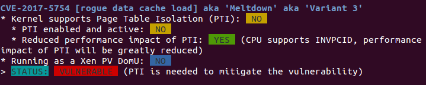

# 利用meltdown漏洞，读取内存内容
## 实验平台
+ 虚拟机：VMware Workstation Pro
+ 系统：ubuntu 14.04
+ 内核版本：4.4.0-31-generic
## 实验准备
1. 关于系统的选择，之前一直使用的是ubuntu 16.04，内核版本是4.13.0-45-generic,但是经过了好长时间的调研都始终无法将meltdown的补丁关闭，所以最终选择了安装一个低版本的虚拟机，果然取得了成功。
2. 关于实验环境的检测，我在这个[网站](https://linuxhint.com/check-patch-spectre-meltdown-ubuntu/)上找到了相关的工具，如图显示，meltdown的漏洞为VULNERABLE，即为可以攻击。

## 实验原理
1. 乱序执行与预测执行
现代cpu为了提高性能，不严格按照指令的顺序串行执行，而是对指令进行分析后，并行处理乱序执行。
还有一种提高效率的方法是预测执行，在遇到分支指令之前，并不解析所有的分支指令，而是预测哪个控制流会更可能被运行，提前将指令进行操作，并将结果保存到cache中。
以上两种方法，可以有效的提高cpu的效率，但是会产生一个问题，为了保证程序的安全正确性，cpu会对程序进行安全检查，但是安全检查这个操作，只有在指令真正被执行结束以后才会执行，而上述的两个操作由于只是将结果保存在缓存中，所以并没有真正的运行结束，所以也就不会马上遇到安全检查。而meltdown正式利用了乱序执行，预测执行与安全检查之间的空窗期。从cache中获得一些私密内容。
2. 缓存边信道攻击
边信道攻击即利用电子设备在运行过程中的时间消耗，功率消耗，或电磁辐射之类的侧信道信息泄漏而进行的对加密设备的攻击方式。在这个实验中，目标程序首先访问内存，该内存块会被写入cache中，此时攻击者只需重新加载每一个内存块，并测量读取时间，即可通过加载时间的长短判断出目标程序读的是哪一个内存块。这样攻击者通过这种方式即可进行内存的越权访问。
## 实验效果
## 参考资料